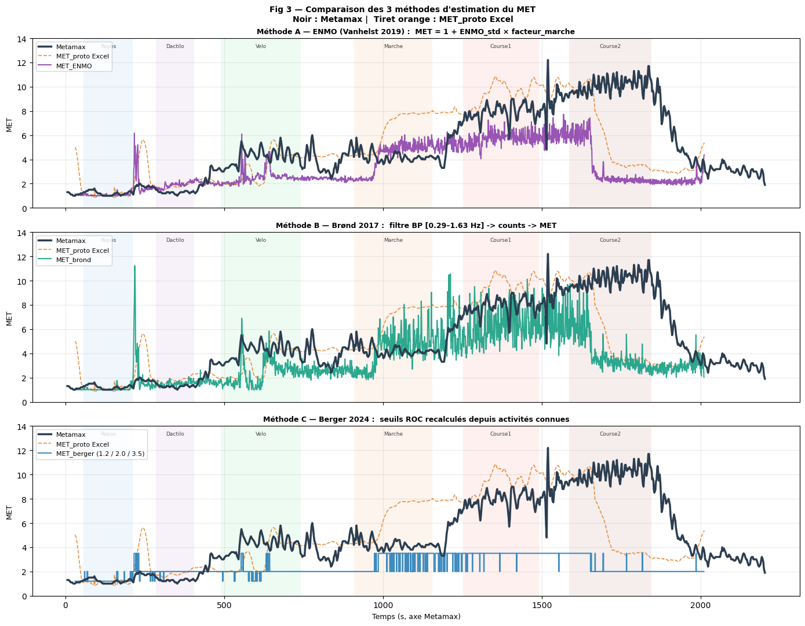
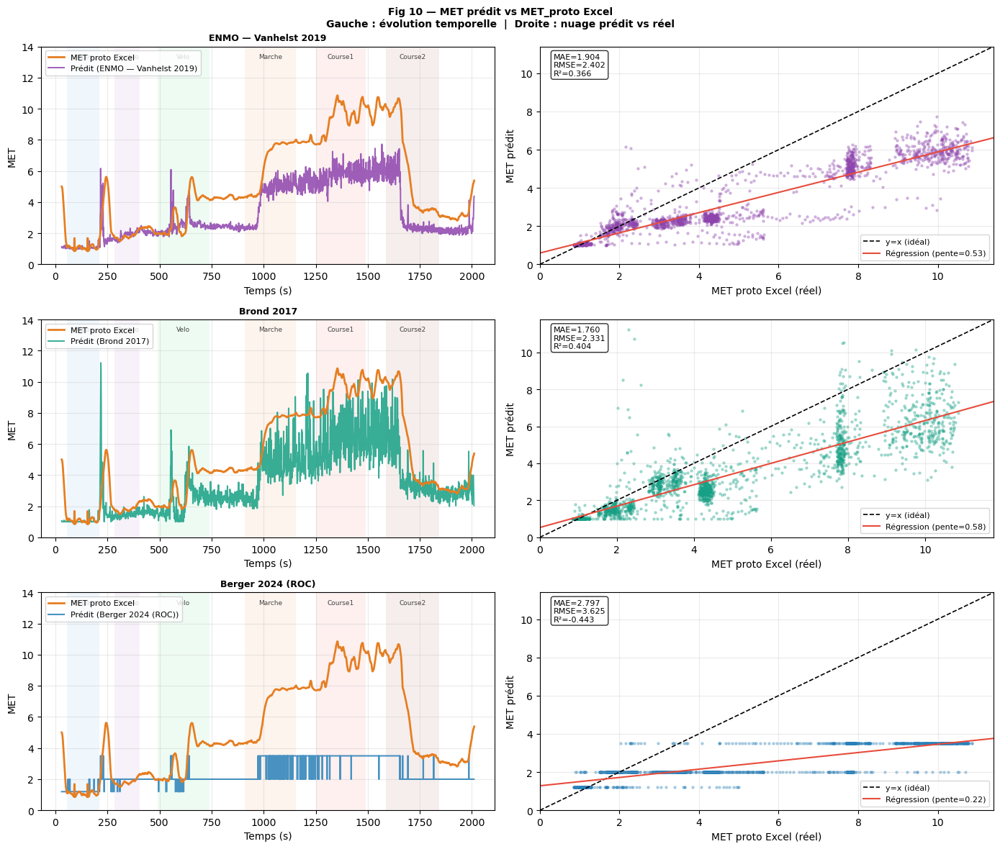
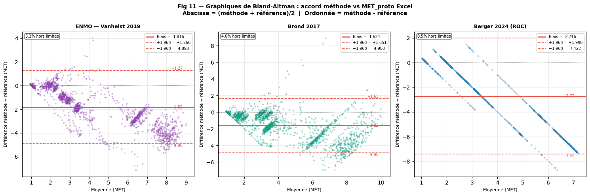
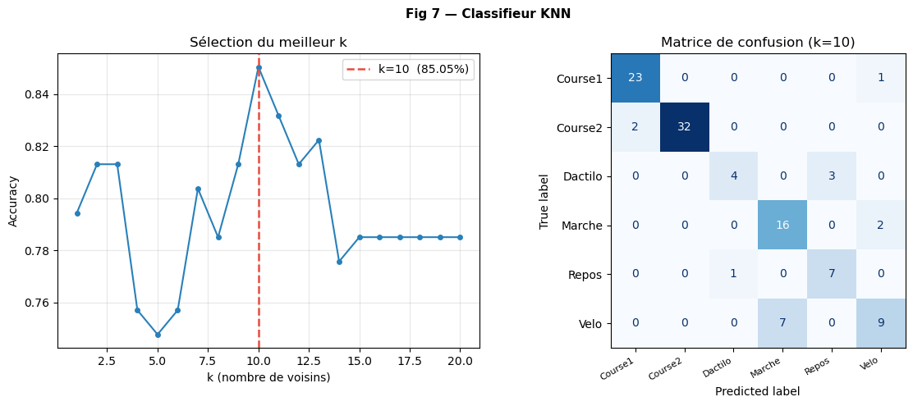

<div align="center">

# Traitement de Données d'Accélérométrie

Analyse de signaux accélérométriques pour l'estimation de la dépense énergétique (MET) - comparaison de méthodes scientifiques et classification supervisée KNN.


</div>

---

## Présentation

Ce projet analyse des données d'accélérométrie issues d'un protocole expérimental d'activité physique afin d'estimer le niveau d'intensité des mouvements exprimé en **MET (Metabolic Equivalent of Task)**.

Trois méthodes issues de la littérature scientifique sont implémentées et comparées sur un même protocole : **ENMO** (Vanhelst, 2019), **Counts ActiGraph** (Brønd, 2017) et **Berger** (2024). Un classifieur supervisé **KNN** a également été développé pour prédire automatiquement l'activité physique réalisée.

---

## Fonctionnalités

**Traitement du signal**
- Synchronisation temporelle entre accéléromètre et référence Metamax
- Standardisation Z-score à partir de la période de repos
- Calcul du vecteur magnitude triaxial (VM = √ax² + ay² + az²)
- Filtrage passe-bande de Butterworth (méthode Brønd)

**Estimation du MET**
- Méthode ENMO : norme euclidienne avec calibration par la marche
- Méthode Counts ActiGraph : reproduction du pipeline ActiGraph à partir de données brutes
- Méthode Berger : classification par seuils ROC

**Machine Learning**
- Classifieur KNN avec optimisation du paramètre k
- Évaluation par matrice de confusion
- Précision globale : **85,05 %** (k = 10)

**Évaluation & Visualisation**
- Métriques statistiques : MAE, RMSE, R², biais moyen
- Graphiques temporels, nuages de corrélation, diagrammes de Bland-Altman
- Interface graphique Tkinter pour l'exploration interactive des résultats

---

## Méthodes implémentées

### ENMO - Vanhelst (2019)
Calcul de la norme euclidienne du mouvement (Euclidean Norm Minus One) après suppression de la composante de repos, suivi d'un lissage sur 1 seconde et d'une calibration à partir de la marche.

```
ENMO(t) = max(0, VM_std(t) − VM_repos)
MET(t) = 1 + ENMO(t) × facteur_marche
```

### Counts ActiGraph - Brønd (2017)
Reproduction du principe des counts ActiGraph : filtrage passe-bande [0.29–1.63 Hz], rectification, quantification et accumulation des signaux par seconde sur chaque axe.

```
VM_counts = √(cx² + cy² + cz²)
```

### Berger - (2024)
Classification par seuils recalculés via courbes ROC, produisant un MET discret à trois niveaux d'intensité.

```
MET(t) = 1.2  si VM < S1
          2.0  si S1 ≤ VM < S2
          3.5  si VM ≥ S2
```

### KNN - K-Nearest Neighbors
Classifieur supervisé entraîné sur les valeurs MET estimées pour prédire automatiquement l'activité physique. Paramètre k optimisé par validation croisée.

---

## Données expérimentales

Les données proviennent d'un accéléromètre triaxial (axes X, Y, Z) et d'un système **Metamax** utilisé comme référence physiologique.

| Activité | Début (s) | Fin (s) | MET attendu |
|---|---|---|---|
| Repos | 57 | 211 | 1.0 |
| Dactylographie | 285 | 405 | 1.5 |
| Vélo | 490 | 740 | 4.0 |
| Marche | 908 | 1155 | 3.5 |
| Course 1 | 1251 | 1491 | 8.0 |
| Course 2 | 1586 | 1844 | 11.0 |

Fréquence d'échantillonnage : ~9,54 Hz

---

## Résultats

### Comparaison des méthodes



Les méthodes ENMO et Brønd reproduisent correctement la progression des activités faibles et modérées. Les deux sous-estiment significativement les phases vigoureuses (Course 1 & 2), où le Metamax dépasse 8–12 MET alors que les méthodes plafonnent à 4–5 MET.

### Évaluation statistique

| Méthode | Référence | MAE | RMSE | R² | Biais |
|---|---|---|---|---|---|
| ENMO (Vanhelst 2019) | Metamax | 2.363 | 3.357 | -0.24 | -2.082 |
| ENMO (Vanhelst 2019) | MET_proto | 2.023 | 2.462 | 0.334 | -1.999 |
| Brønd 2017 | Metamax | 2.092 | 2.978 | 0.026 | -1.751 |
| Brønd 2017 | MET_proto | 1.924 | 2.725 | 0.185 | -1.663 |
| Berger 2024 | Metamax | 2.955 | 3.915 | -0.683 | -2.797 |
| Berger 2024 | MET_proto | 2.795 | 3.628 | -0.445 | -2.709 |

> **Brønd** obtient les meilleures performances globales (MAE le plus faible vs Metamax). **ENMO** présente le meilleur R² contre MET_proto (0.334). **Berger** est davantage adapté à la classification de niveaux qu'à l'estimation continue.

### Corrélations et Bland-Altman





### Classifieur KNN



- **Meilleur k** : 10 - Précision : **85,05 %**
- Course 1 : 23/24 correctement classifiées | Course 2 : 32/34
- Confusions principales : Vélo ↔ Marche (MET proches), Dactylographie ↔ Repos

---

## Pipeline

```
Chargement des données (data.xls)
         │
         ▼
Pré-traitement
(Synchronisation +220s · Suppression lignes invalides · Z-score)
         │
         ▼
Calcul du vecteur magnitude triaxial
         │
         ▼
Estimation du MET
   ┌─────┼──────┐
 ENMO  Brønd  Berger
         │
         ▼
Classification KNN
         │
         ▼
Évaluation statistique
(MAE · RMSE · R² · Biais)
         │
         ▼
Visualisation & Interface Tkinter
```

---

## Architecture du code

```
accelerometrie/
├── accélérométrie.ipynb     # Notebook principal
├── data.xls             # Données expérimentales
├── stats_methodes.xlsx  # Métriques statistiques
├── fig#***.png  # Graphiques générés automatiquement
└── images/                  # Captures pour le README

NB : Les figures et fichiers .xls sont générés automatiquement après exécution du code
```

---

## Interface graphique (Tkinter)

Une interface interactive permet l'exploration des résultats sans exécuter le notebook.

**Onglet Prédiction** - Saisie d'une valeur MET → activité prédite par le KNN + barre de niveau d'effort colorée (Sédentaire / Légère / Modérée / Vigoureuse)

**Onglet Résultats** - Tableau des métriques avec mise en évidence automatique de la meilleure méthode

**Onglet Figures** - Grille des 13 figures générées avec ouverture directe

---

## Dépendances principales

```
numpy
pandas
scipy
matplotlib
seaborn
scikit-learn
openpyxl
```

---

## Références

- Vanhelst, J. et al. (2019). *Quantification de l'activité physique par l'accélérométrie*. Revue d'Épidémiologie et de Santé Publique.
- Brønd, J. C. et al. (2017). *Generating ActiGraph Counts from Raw Acceleration Recorded by an Alternative Monitor*. Medicine & Science in Sports & Exercise.
- Berger, M. et al. (2024). *Évaluation du positionnement optimal d'un accéléromètre pour mesurer la durée et le type d'activité physique*. Mains Libres, 4, 227–236.
- Ainsworth, B. et al. (2011). *Compendium of Physical Activities*.

---
